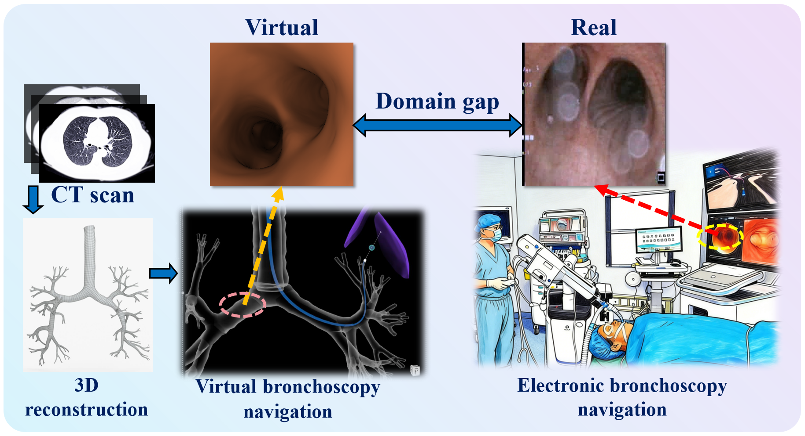
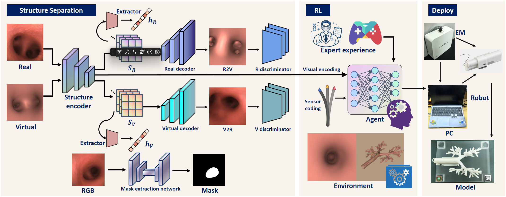
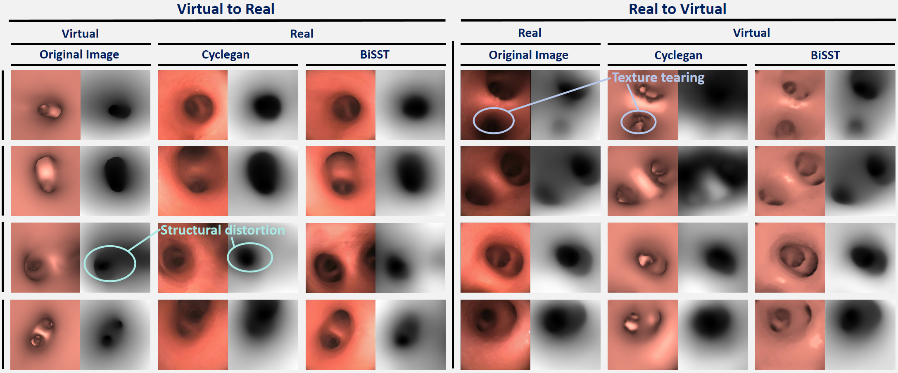
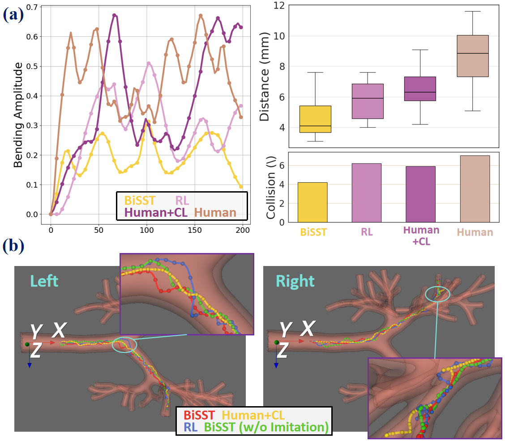

# BiSST Project:

Code of BiSST: Bidirectional Structure-Guided Style Translation for robotic bronchoscopy navigation.
# Bronchoscopy-Visual-Localization

An algorithm for bronchoscopy visual navigation.
Bi directional style transfer of bronchoscopy endoscopy. Can be used for endoscopic enhancement, dataset expansion, RL-sim2real。
Based on the previously submitted paper, the AI was used to reproduce it again (the handwritten version was too confusing). There are slight differences in dimensions, data, and structure, and it is only used as a complete process test.
System: 
Contrast: 

RL sim2real:
Current focus:
- Virtual-to-real bronchoscopic image translation
- Real-to-virtual bronchoscopic image translation
- Structure-preserving style transfer
- Mask-guided structural consistency
- Structure embedding consistency
 
## Project Structure

```text
BiSST/
├── data/
│   ├── raw/
│   │    ├── real/
│   │    └── virtual/
│   ├── processed/
│   └── masks/
├── src/
│   ├── datasets/
│   ├── models/
│   ├── losses/
│   ├── train/
│   ├── infer/
│   ├── eval/
│   └── utils/
├── tools/
├── checkpoints/
└── results/

